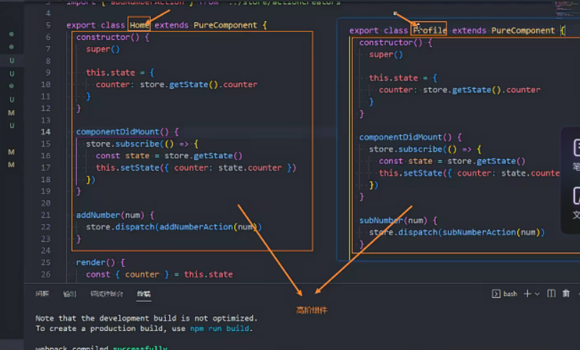

## React的技术特点、优点

声明式编程

组件化开发

一次学习，多平台适配

## React的开发依赖及引入方式

vue 只依赖一个

react 依赖3个，按需引入，各司其职，更加清晰 

## React组件化开发

一个组件里面重要的三个组成部分：数据、方法（事件绑定）、渲染

其中事件绑定的时候，要注意this指向的问题

## 什么是jsx，以及为什么选择jsx

JavaScript extension or JavaScript XML

选择原因：符合组件的内容密不可分的需求，all in js

## JSX语法规范

一个根元素

（）让结构更清晰

单双标签皆可

注释写法

嵌入变量作为子元素

嵌入表达式

属性绑定：全局属性、专用属性、类名、样式

## JSX事件绑定

### 添加事件的方法：

①原生方法 

②onClick={事件绑定的回调函数} React提供的语法糖

基于React中this指向问题，JSX在绑定事件回调函数时，需考虑this指向：

①bind绑定this（可以在回调函数中或constructor构造器中绑定）

②回调函数this.foo

foo采用箭头函数写法，内部使用this时，通过作用域链向上查找到class类

③回调函数直接采用箭头函数写法，箭头函数内部直接调用foo方法——这样回调函数执行的时候，就会立即执行foo函数

回调函数（）=>{this.foo()}

### 参数传递

event对象

React绑定事件onClick语法糖中，默认已经将当前元素作为event对象了

其他对象

## 事件绑定案例——导航栏样式切换（直接写or封装抽取）

关键点：在渲染时将对应的元素绑定上序号，以便后续选择性操作某一个元素

## 条件渲染

条件判断语句

三元运算符

与运算符&&

类v-show效果

可选链？

## 列表渲染

常规展示：map函数

筛选展示：filter函数、slice函数

## 列表中的key

## JSX的本质

## jsx-虚拟DOM-真实DOM

## 购物车案例（待学）

计算总价格：

方法一：for循环

方法二：reduce方法

## 脚手架的定义

## manifest文件的功能：PWA功能（再查一下MDN）

### PWA功能：（类似于Native App相关的功能）

① App Mainfest （安装）

如果一个网站是用PWA开发的，那么可以在桌面上配置相应的图标，相当于将一个网站变成了类似原生app的应用

可以添加至主屏幕，点击主屏幕图标可以实现启动动画以及隐藏地址栏；

② Service Worker （离线）

 实现离线缓存功能，即使用户手机没有网络，依然可以使用一些离线功能；

③ 实现了消息推送； 

## React组件化开发

组件化开发概念：分而治之

组件分类，以及每类组件的定义

+ 根据组件的定义方式，可以分为：函数组件(Functional Component )和类组件(Class Component)； 

+ 根据组件内部是否有状态需要维护，可以分成：无状态组件(Stateless Component )和有状态组件(Stateful Component)； 

+ 根据组件的不同职责，可以分成：展示型组件(Presentational Component)和容器型组件(Container Component)；

核心区分：关注数据逻辑  VS  UI展示

+ 函数组件、无状态组件、展示型组件主要关注UI的展示； 

+ 类组件、有状态组件、容器型组件主要关注数据逻辑； 

## 类组件

类组件的定义要求

constructor有时候可以省略（会默认执行并继承父类的props）

## 函数式组件

## render函数的返回值

react元素

数组或fragments

Portals

字符串或数值类型

布尔类型或null

注意：render函数可以从this.state和this.props中取值

## 生命周期

功能：在最合适的时间，完成某项功能

重点举例：每个生命周期中适合干什么事情

## 组件的嵌套

## 组件间的通信

### ① 父子之间：

父传子：属性=值  子组件通过props获取

子传父：父组件给子组件传递一个回调函数，在子组件中调用这个函数

### ② context

+ 基于React包创建一个context实例（最好是新建一个js文件，作为全局使用）
+ 通过context实例中的Provider中的value属性为后代组件提供数据
+ 在需要用到的子组件中，将该组件的contextType设为创建的context实例
+ 在子组件内部获取数据，并且使用数据

注意：

特殊情况一：函数式组件中，组件没有contextType属性，此时需要在内部用context实例中的Consumer获取数据

特殊情况二：如果创建了多个context上下文，都给某个子组件传递了数据，而组件的contextType属性只能设置一次，那么只能在组件内部用Consumer按需获取不同的数据（Consumer更加灵活）

### ③ 事件总线 Event-bus 跨组件传递（`不会，重新学`——第1494节课）

是不是可以写到简历里面去？两个组件的展示信息联动切换——参照别人的案例

注意：props如果是一个对象时，在传递的时候，可以用{...props}来传递——展开运算符

## 组件通信案例练习

## 数据类型校验 propTypes

对于传递给子组件的数据，有时候可能希望进行验证

类型校验

必传项

默认值 defaultProps

## React中的插槽的几种方案

（1）组件的children子元素（子元素为一个时，children即为该元素；子元素有多个时，children为子元素数组）

+ 可以通过propTypes限制children的个数

（2）props属性传递react元素

（3）作用域插槽（`待补充`）—— 函数回调

## setState（`重要原理`）

### vue和react数据管理和渲染流程的对比

vue：

+ template =》 render

+ 修改数据时，会自动劫持？相当于自动调用setState？

React：

+ render =》 自己调用this.setState()

React中的问题：只要调用setState就会更新（就算数据没改变）—— 导致性能不够优化

解决方案：

① 在shouldComponeUpdate钩子里面判断state状态是否改变，只有数据变化时，才返回true，打开阀门

② 使用PureComponent

## setState的三种写法以及应用场景

## 为什么将setState设计为异步？

### React18之后都是异步处理，默认所有的操作都被放到了批处理中（异步处理）

setState设计为异步，可以显著地提升性能，如果每次调用setState都更新且调用render，效率比较低。设计为异步可以批量获取多次setState的结果再批量进行更新

异步执行可以保持state和props的一致性，避免开发中的问题（`不理解？？？`）

### React18之前：

 在组件生命周期（componentDidMount）或React合成事件（事件绑定回调函数）中，setState是异步

在在setTimeout或原生dom事件中，setState是同步

### 同步执行的特殊方法

如何在setState函数的结果可以拿到，则需要执行特殊的flushSync操作

## React的渲染流程和更新流程

渲染：JSX——虚拟DOM——真实DOM

更新：props/state改变——render函数重新执行——产生新的DOM树——新旧DOM树进行diff——计算出差异进行更新——更新到真实的DOM

diff算法的复杂程度为O(n³)，React对这个算法进行了优化，将其优化成了O(n)：

同层节点之间相互比较，不会跨节点比较；

不同类型的节点，产生不同的树结构；

开发中，可以通过key来指定哪些节点在不同的渲染下保持稳定

## 使用key对diff比较的优化（使用index作为key是没有优化效果的）

## SCU优化与PureComponent

### 函数式组件中，也提供了类似的功能——memo

## 数据不可变的力量

PureComponent中不能直接修改已经直接修改state中已经定义好的数据数组（指push新数据进去）

原因：PureConponent相当于SCU钩子中做的是浅层比较props和state（shallowEqual）

正确修改方式：如果需要修改，需要将原来数组拷贝一份，对新数组修改后，再setState改变数据

## ref获取原生DOM（react元素）的三种方式

方式一：react元素绑定ref字符串——通过this.refs.xxx取到

方式二：提前用createRef创建ref对象（这一步通常在constructor中），将其绑定到react元素——ref对象上的current属性值就是对应的元素

方式三：传入一个回调函数，在对应的元素被渲染之后，回调函数被执行，并且将元素传入

## ref获取组件DOM

### 类式组件（方法同上）

函数式组件没有ref属性，需要借助forwardRef对函数组件进行转换

## 受控组件与非受控组件

形式区别，某个表单元素是否有form值

非受控组件：表单数据由DOM本身处理，不受setState控制，通过ref获得表单值（非受控组件中一般用defaultValue来设置值）

受控组件：表单数据保存在state中，绑定onChange事件，由setState控制值的改变（好处之一：可以避免使用ref）

## 表单组件案例练习（`一定要练习`）

## 高阶函数与高阶组件

### 高阶函数：

至少满足以下条件之一：

① 接受一个或多个函数作为输入

② 输出一个函数

### 高阶组件：

高阶组件本身不是一个组件，而是一个函数

这个函数的参数是一个组件，返回值也是一个组件

高阶组件并不是react api 的一部分，她是基于react的组合特性而形成的设计模式

常用于react第三方组件库：

+ redux中的connect

  export default connect(fn1，fn2)(Home) —— 将redux中的数据，植入到Home中的props里面

+ react-router中的withRouter

`高阶组件实际案例练习：`

+ 增强props

+ context consumer的封装
+ 对某些页面做登陆鉴权（`小花猫项目登陆功能改进`）
+ 测试某个组件or页面渲染所需要的时间
+ memo包裹函数式组件实现数据浅层比较
+ forwardRef

思考：`是不是可以用高阶函数优化芯汇官网？` —产品展示部分

## 组件复用方法与缺陷：

mixin：可能会相互依赖、耦合，不利于代码维护，mixin中的方法可能汇互相冲突

HOC（高阶组件）：在原组件上进行包裹或嵌套，如果大量使用HOC，将会嵌套复杂，调试困难；HOC可以劫持props，层层改变下可能会覆盖原来所需的props值

Hooks的出现解决了类式组件中this指向问题、hoc的嵌套复杂度问题等

## Portals

Portal 提供了一种将子节点渲染到存在于父组件以外的 DOM 节点的优秀的方案：

+ 第一个参数（child）是任何可渲染的 React 子元素，例如一个元素，字符串或 fragment； 

+ 第二个参数（container）是一个 DOM 元素； 

ReactDOM.createPortal(child, container)

**Modal组件案例（`完成练习`）**

## Fragment

<></>是fragment的语法糖

但是，如果我们需要在Fragment中添加key，那么就不能使用短语法

## React严格模式

为后代元素触发额外的检查和警告

可以为应用程序的任何部分启用严格模式

**严格模式监测的内容**：

 

1. 识别不安全的生命周期：

2. 使用过时的ref API

3. 检查意外的副作用

   + 这个组件的constructor会被调用两次；

   + 这是严格模式下故意进行的操作，让你来查看在这里写的一些逻辑代码被调用多次时，是否会产生一些副作用；

   + 在生产环境中，是不会被调用两次的；

4. 使用废弃的findDOMNode方法
   + 在之前的React API中，可以通过findDOMNode来获取DOM，不过已经不推荐使用了，可以自行学习演练一下

5. 检测过时的context API

   + 早期的Context是通过static属性声明Context对象属性，通过getChildContext返回Context对象等方式来使用Context的；

   + 目前这种方式已经不推荐使用，大家可以自行学习了解一下它的用法；

## React过渡动画（`新知识点！重学！`）

`taro-ui技术项目——组件库开发中可以使用（提升用户体验）`

## React的CSS

组件化开发中CSS解决方案应该具备的特点：

+ 可以编写局部css：css具备自己的具备作用域，不会随意污染其他组件内的元素；
+ 可以编写动态的css：可以获取当前组件的一些状态，根据状态的变化生成不同的css样式；
+ 支持所有的css特性：伪类、动画、媒体查询等；
+ 编写起来简洁方便、最好符合一贯的css风格特点；

### 内联样式CSS写法

写法差异：小驼峰形式

可以引入state中的状态设置相关的样式

优点: 样式不会冲突、可以动态获取state中的样式

缺点：样式书写无提示、大量样式会造成代码混乱、不支持某些样式（伪类/伪元素）

### 普通CSS文件写法

单独引入css样式文件

缺点：普通css属于全局，样式之间可能会相互层叠

### CSS Modules写法（`新知识点`）

React的脚手架已经内置了css modules的配置：

.css/.less/.scss 等样式文件都需要修改成.module.css/.module.less/.module.scss 等

优点：css modules解决了局部作用域的问题

缺点：

+ 引用的类名，不能使用连接符(.home-title)，在JavaScript中是不识别的；

+ 所有的className都必须使用{style.className} 的形式来编写；

+ 不方便动态来修改某些样式，依然需要使用内联样式的方式； 

  

### CSS in JS （`新知识点`）

CSS-in-JS 是指一种模式，其中 CSS 由 JavaScript 生成而不是在外部文件中定义

CSS-in-JS的模式就是一种将样式（CSS）也写入到JavaScript中的方式，并且可以方便的使用JavaScript的状态

优点： 

CSS-in-JS`通过JavaScript来为CSS赋予一些能力`，包括类似于CSS预处理器一样的`样式嵌套、函数定义、逻辑复用、动态修改状态`等等； 

缺点：

虽然CSS预处理器也具备某些能力，但是获取动态状态依然是一个不好处理的点；

 

### style-components库（`新知识点`）

### classnames库（`新知识点`）

## 纯函数

+ 确定的输入，一定会产生确定的输出

  输出结果与输入值以外的其他隐藏信息或状态无关，也和由I/O设备产生的外部输出无关

+ 函数在执行过程中，不能产生副作用

  副作用指：诸如“触发事件”，使输出设备输出，或更改输出值以外物件的内容等。

### 副作用概念

在计算机科学中，也引用了副作用的概念，表示在执行一个函数时，除了返回函数值之外，还对调用函数产生了附加的影响，比如修改了全局变量，修改参数或者改变外部的存储；

副作用是bug产生的温床

### 纯函数的作用和优势

可以安心编写和使用，只需关注业务逻辑，无需关注传入内容的获得和依赖的外部变量是否修改

确定的输入会有确定的输出，且输入内容不会被篡改

### 纯函数的应用

+ react中的函数式组件(class组件也需保护props不被更改)

+ redux中的reducer

+ slice就是一个纯函数，不会修改数组本身

## Redux

### 前端状态管理现状特点：

+ 需要管理的状态多而复杂：包括服务器返回的数据、缓存数据、用户操作产生的数据等，也包括一些UI的状态，比如某些元素是否被选中，是否显示加载动效，当前分页
+ 状态之间互相依赖，联动变化，变化难以控制和追踪

### React与Redux的关系

React主要负责管理视图，Redux用来管理state

### Redux定义

Redux就是一个帮助我们管理state的容器：Redux是`JavaScript的状态容器`，提供了`可预测的状态管理`

## Redux的核心理念

store——定制规范用于追踪数据变化

action——更新数据

+ 所有数据的变化，必须通过`派发（dispatch）action来更新`
+ action是一个普通的JavaScript对象，用来`描述`这次更新的`type和content`
+ action是固定的对象，应用中，会通过函数来定义，返回一个action

reducer——执行数据

+ reducer是一个纯函数

+ reducer做的事情就是`将传入的state和action结合起来生成一个新的state`

## Redux的三大原则

### 单一数据源

+ state被存储在一颗object tree中，并且这个object tree只存储在一个 store 中（并非不能建立多个store）
+ `单一的数据源`可以让整个应用程序的state变得`方便维护、追踪、修改`

### State是只读的

+ 唯一修改State的方法一定是触发action
+ 可以`保证所有的修改都被集中化处理`，并且`按照严格的顺序来执行`，所以`不需要担心race condition（竟态）的问题`

### 使用纯函数来执行修改

+ 通过reducer将 旧state和 actions联系在一起，并且返回一个新的State
+ 随着应用程序的复杂度增加，我们`可以将reducer拆分成多个小的reducers`，分别操作不同state tree的一部分
+ `所有的reducer都应该是纯函数`，不能产生任何的副作用

## Redux使用

使用store中的数据

修改store中的数据——store.dispatch

订阅store中的数据——store.subscribe(() => {})

动态生成action——定义actionCreators函数

目录结构优化——actionCreators单独文件 + actionCreators常量单独文件 + reducers单独文件

## React-Redux

### 核心理念：

connect(mapStateToProps, mapDispatchToProps)(App)

store需要通过父组件传递props到子组件中，不能自己引入

### 异步网络请求：

安装redux-thunk 添加中间件middleware

### Redux模块的拆分（团队协作）

将不同的模块进行拆分，将会有多个reducer，最终在总文件汇集，需要用combineReducer将多个reducer合并

`combineReducer实现原理（源码）`

## Redux Toolkit

### 核心概念：

+ configureStore：包装createStore以提供简化的配置选项和良好的默认值。它可以自动组合你的 slice reducer，添加你提供的任何 Redux 中间件，redux-thunk默认包含，并启用 Redux DevTools Extension。 

+ createSlice：接受reducer函数的对象、切片名称和初始状态值，并自动生成切片reducer，并带有相应的actions。 

+ createAsyncThunk: 接受一个动作类型字符串和一个返回承诺的函数，并生成一个pending/fulfilled/rejected基于该承诺分派动作类型的 thunk

### Redux Toolkit 数据的不可变性

immer.js

immutable.js

为了节约内存，又出现了一个新的算法：Persistent Data Structure（持久化数据结构或一致性数据结构）:

+ 用一种数据结构来保存数据；
+ 当数据被修改时，会返回一个对象，但是新的对象会尽可能的利用之前的数据结构而不会对内存造成浪费；

### 自己封装实现connect（解耦操作）

### 中间件底层实现原理

打印日志案例——log中间件

猴补丁

thunk中间件

## 状态管理方案对比

借助shopplist案例写出每一步方案

## React-Router

### 路由映射配置

### Link 和 NavLink

### Not Found页面配置： 

配置对应的Route，并且设置path为*即可

### navigate作用：

①跳转页面 ②默认选中某页面

### 路由嵌套

### 页面懒加载

suspense 

## React Hooks